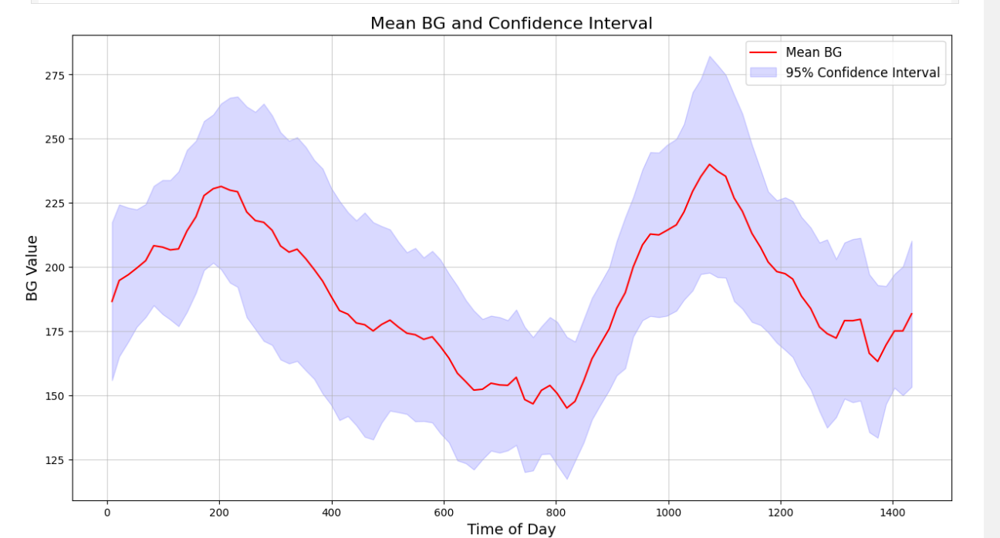

# Blood Glucose Prediction using LSTM
This project aims to predict blood glucose (BG) levels using Long Short-Term Memory (LSTM) neural networks. The dataset consists of BG readings from an actual patient with Type 1 Diabetes, collected using the Abbott Freestyle Libre Pro Flash GlucoMeter. The process involves data preprocessing, feature extraction, model training, and evaluation to accurately forecast BG levels.

## Process Overview

1. **Import the CSV**:
    - Load the raw CGM data from a CSV file.

2. **Prepare Dataframe**:
    - Extract relevant features such as timestamp, BG level, time of day, and weekday from the raw data.
    - Create a new DataFrame with these features.

3. **Plot last 10 days BG readings**:
    - Visualize the BG readings for the last 10 unique days.

4. **Plot the confidence intervals and mean BG over 10 days**:
    - Resample the data into 15-minute intervals.
    - Calculate the mean BG and confidence intervals for the last 10 days.
    - Plot the mean BG and confidence intervals.

5. **Set dataset size and readings for prediction**:
    - Prepare train, validation, and test datasets for direct forecasting with LSTM.
    - Create sequences of features and corresponding labels for direct forecasting.

6. **Normalize the Features**:
    - Normalize the features consistently across train, validation, and test sets using MinMaxScaler.

7. **Train Model**:
    - Define and compile the LSTM model.
    - Train the model with model checkpointing and TensorBoard logging.

8. **Save Model**:
    - Save the trained model for future use.

9. **Make Predictions on Test set**:
    - Load the trained model.
    - Make predictions on the test set.
    - Evaluate the model using Root Mean Squared Error (RMSE).

10. **Make New Predictions**:
     - Plot actual vs. predicted BG values.

11. **Trend Analysis**:
     - Calculate Directional Accuracy (DA) to measure the proportion of times the direction of change is correctly predicted.

